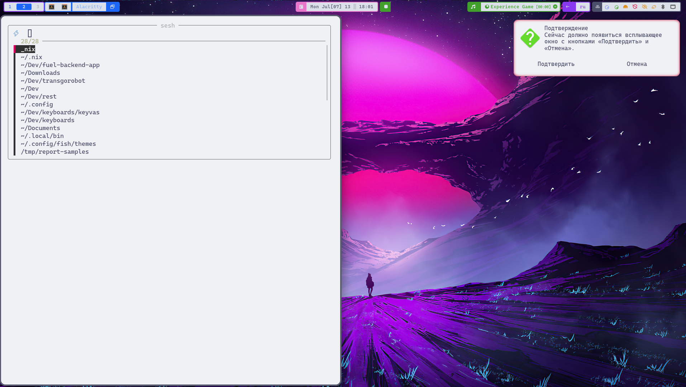

# NixOS Config

Конфигурация NixOS на flake с несколькими хостами, Home Manager, встроенным в систему, и управлением секретами через sops-nix.



## Структура репозитория

```
flake.nix
hosts/           # конфигурация конкретных машин
nixos/           # системные модули (сеть, niri, docker, sops, …)
linux-app/       # пользовательские программы и Home Manager-модули
  shell/         # zsh, fish, starship, tmux
  cli/           # bat, eza, git, k9s, …
  editors/       # neovim, ghostty, alacritty
  browsers/      # firefox
  desktop/       # niri, waybar, stylix, fuzzel
  apps/          # 1c, walker, mpd, obsidian, …
  packages.nix   # пакеты без отдельного конфига
secrets/         # зашифрованные секреты (sops)
```

## Возможности

- Несколько хостов: `maximus`, `chicago`, `lenovo`, `pazajik`
- Рабочий стол: Niri + Waybar + SwayNC на Wayland
- Тема: Stylix (Catppuccin Latte)
- Home Manager встроен в NixOS — один rebuild для системы и пользователя
- Секреты через [sops-nix](https://github.com/Mic92/sops-nix) (age)

## Быстрый старт

### 1. Клонировать репозиторий

```bash
git clone git@github.com:efremovich/nixos-config.git ~/.nix
cd ~/.nix
```

### 2. Настроить секреты

См. раздел [Работа с секретами](#работа-с-секретами) ниже.

### 3. Подготовить хост

```bash
cd hosts
cp -r maximus <your_hostname>
cd <your_hostname>
cp /etc/nixos/hardware-configuration.nix ./
```

Отредактируйте `host.nix` при необходимости и добавьте хост в `flake.nix`.

### 4. Применить конфигурацию

```bash
sudo nh os switch
# или
sudo nixos-rebuild switch --flake ~/.nix#<hostname>
```

Алиасы в shell: `upnix`, `uphome`, `sw` — все ведут на `nh os switch`.

## Работа с секретами

Секреты хранятся в зашифрованном файле [`secrets/secrets.yaml`](secrets/secrets.yaml). В git попадает только шифротекст; расшифровка возможна только при наличии age-ключа на машине.

### Первичная настройка (один раз на машине)

```bash
# 1. Создать age-ключ
mkdir -p ~/.config/sops/age
age-keygen -o ~/.config/sops/age/keys.txt

# 2. Добавить публичный ключ в secrets/.sops.yaml (если настраиваете с нуля)
age-keygen -y ~/.config/sops/age/keys.txt
# вставить ключ в creation_rules → key_groups → age

# 3. Заполнить секреты
sops secrets/secrets.yaml
```

Шаблон полей — в [`secrets/secrets.yaml.example`](secrets/secrets.yaml.example).

### Какие секреты используются

| Ключ | Назначение |
|------|------------|
| `tfs_pat` | Personal Access Token для `https://tfs.astralnalog.ru/` (git) |
| `anthropic_api_key` | API-ключ для walker (niri) |
| `waybar_ssh_host` | Хост SSH-туннеля в waybar |
| `waybar_ssh_user` | Пользователь SSH-туннеля |
| `waybar_ssh_port` | Порт SSH |
| `waybar_proxy_port` | Локальный SOCKS-порт туннеля |
| `waybar_ssh_key_file` | Путь к приватному SSH-ключу |
| `waybar_nats_url` | URL NATS для operator-queues |
| `waybar_nats_creds_file` | Путь к creds-файлу NATS |

После `nh os switch` секреты доступны в `/run/secrets/<имя>`. Приложения читают их в runtime — секреты **не попадают** в Nix store при сборке.

### Редактирование секретов

```bash
# открыть зашифрованный файл в редакторе (sops расшифрует и зашифрует обратно)
sops secrets/secrets.yaml

# посмотреть расшифрованное содержимое
sops -d secrets/secrets.yaml
```

### Добавить новый секрет

1. Добавить ключ в `secrets/secrets.yaml` через `sops secrets/secrets.yaml`
2. Зарегистрировать в [`nixos/modules/sops.nix`](nixos/modules/sops.nix):

```nix
sops.secrets.my_new_secret = {
  owner = user;
  mode = "0400";
};
```

3. Использовать в конфиге через `/run/secrets/my_new_secret` или в activation-скрипте Home Manager
4. Применить: `sudo nh os switch`

### Добавить ключ на другую машину

```bash
# на новой машине — сгенерировать ключ и показать публичную часть
age-keygen -o ~/.config/sops/age/keys.txt
age-keygen -y ~/.config/sops/age/keys.txt

# на машине с доступом к репозиторию — добавить ключ в .sops.yaml и обновить
sops updatekeys secrets/secrets.yaml
```

### Что не хранится в sops

- Публичные CA-сертификаты (`nixos/certs/`) — в git намеренно
- Приватные SSH-ключи — остаются в `~/.ssh/`, в sops только путь к ним
- NATS creds-файлы — остаются в `~/.config/nats/`, в sops только путь

### Безопасность

- Не коммитьте `~/.config/sops/age/keys.txt` и `secrets/tfs_pat.txt`
- При утечке PAT — немедленно отозвать токен в TFS и обновить через `sops secrets/secrets.yaml`
- Репозиторий публичный: внутренние IP и хосты зашифрованы в `secrets.yaml`

## Хосты

| Хост | Boot | GPU |
|------|------|-----|
| maximus | systemd-boot | — |
| lenovo | systemd-boot | — |
| chicago | grub | AMD |
| pazajik | systemd-boot | AMD |

Хост-специфичные пакеты — в `hosts/<hostname>/host.nix`.

## Обновление

```bash
sudo nh os switch              # применить конфиг
sudo nh os switch --update     # обновить flake inputs и применить
```

## Лицензия

См. [LICENSE](LICENSE).
